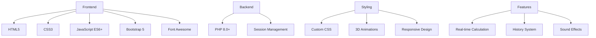

# 🧮 Modern Scientific Calculator

[](https://php.net)
[](https://developer.mozilla.org/en-US/docs/Web/JavaScript)
[](https://www.w3.org/Style/CSS/)
[](https://html.spec.whatwg.org/)
[](https://getbootstrap.com)
[](LICENSE)

> **Kalkulator web modern dengan mode Standard dan Scientific yang dilengkapi dengan riwayat perhitungan, animasi interaktif, dan user interface yang responsif.**

## 🌟 **Demo Live**

[**🚀 Lihat Demo**](https://your-demo-url.com) | [**📱 Mobile Demo**](https://your-mobile-demo.com)

## 📋 **Daftar Isi**

- [✨ Fitur Utama](#-fitur-utama)
- [🎯 Preview](#-preview)
- [🚀 Quick Start](#-quick-start)
- [📦 Instalasi](#-instalasi)
- [🔧 Teknologi](#-teknologi)
- [💻 Penggunaan](#-penggunaan)
- [🎨 Customization](#-customization)
- [🌐 Browser Support](#-browser-support)
- [📱 Mobile Support](#-mobile-support)
- [🤝 Contributing](#-contributing)
- [📄 License](#-license)
- [🙏 Acknowledgments](#-acknowledgments)

## ✨ **Fitur Utama**

### 🧮 **Dual Mode Calculator**
- **Standard Mode**: Operasi matematika dasar (+, -, ×, ÷)
- **Scientific Mode**: Fungsi trigonometri, logaritma, eksponensial, dan faktorial
- **Flip Animation**: Transisi smooth antar mode dengan animasi 3D

### 📊 **Smart History System**
- **Real-time History**: Menyimpan 7 perhitungan terakhir
- **Session Storage**: Menggunakan PHP Session untuk persistensi
- **Animated Timeline**: Riwayat dengan animasi slide-in yang smooth
- **Clear History**: Opsi untuk menghapus riwayat dengan konfirmasi

### 🎨 **Modern UI/UX**
- **3D Design**: Efek perspektif dan shadow yang modern
- **Smooth Animations**: Micro-interactions pada setiap tombol
- **Responsive Layout**: Optimized untuk desktop, tablet, dan mobile
- **Dark/Light Theme**: [Coming Soon] Support untuk multiple themes

### 🔊 **Interactive Elements**
- **Sound Effects**: Feedback audio pada setiap tombol
- **Tactile Feedback**: Animasi press/release pada tombol
- **Keyboard Support**: [Coming Soon] Shortcut keyboard
- **Gesture Support**: [Coming Soon] Swipe gestures untuk mobile

### 🛡️ **Error Handling**
- **Division by Zero**: Penanganan error yang elegant
- **Invalid Input**: Validasi input yang comprehensive
- **Memory Management**: Optimized untuk performance

## 🎯 **Preview**

### 🖥️ **Desktop View**

| Standard Mode | Scientific Mode |
|:-------------:|:---------------:|
|  |  |

### 📱 **Mobile Responsive**

<div align="center">
  
</div>

## 🚀 **Quick Start**

### ⚡ **Instalasi Cepat (5 menit)**

```bash
# 1. Clone repository
git clone https://github.com/whympxx/Kalkulator-Standar-Scientific.git

# 2. Masuk ke direktori
cd Kalkulator-Standar-Scientific

# 3. Jalankan dengan PHP built-in server
php -S localhost:8000

# 4. Buka browser
# http://localhost:8000/kalkulator.php
```

### 🌐 **Atau gunakan dengan Web Server**

```bash
# Untuk XAMPP/WAMP/LAMP
# Copy folder ke htdocs/www
# Akses: http://localhost/Kalkulator-Standar-Scientific/kalkulator.php
```

## 📦 **Instalasi**

### 📋 **Requirements**

| Requirement | Minimum Version | Recommended |
|-------------|:---------------:|:-----------:|
| PHP | 7.0+ | 8.0+ |
| Web Server | Apache/Nginx | Apache 2.4+ |
| Browser | Modern Browser | Chrome 90+ |

### 🔧 **Instalasi Detail**

#### **Method 1: Manual Download**

1. **Download** project sebagai ZIP
2. **Extract** ke web server directory
3. **Akses** melalui browser

#### **Method 2: Git Clone**

```bash
# Clone repository
git clone https://github.com/whympxx/Kalkulator-Standar-Scientific.git

# Masuk ke direktori
cd Kalkulator-Standar-Scientific

# Set permissions (Linux/Mac)
chmod 755 *.php
```

#### **Method 3: Docker (Coming Soon)**

```bash
# Using Docker
docker run -p 8080:80 kalkulator-app
```

## 🔧 **Teknologi**

### 🏗️ **Tech Stack**



### 📚 **Dependencies**

```json
{
  "frontend": {
    "bootstrap": "5.3.0",
    "font-awesome": "6.4.0",
    "css3": "latest",
    "javascript": "ES6+"
  },
  "backend": {
    "php": ">=7.0",
    "session": "built-in"
  },
  "optional": {
    "docker": "latest",
    "nginx": "1.20+",
    "apache": "2.4+"
  }
}
```

## 💻 **Penggunaan**

### 🎮 **Basic Usage**

1. **Standard Mode**
   - Klik angka untuk input
   - Pilih operator (+, -, ×, ÷)
   - Tekan '=' untuk hasil
   - Lihat riwayat di sidebar

2. **Scientific Mode**
   - Flip ke mode Scientific
   - Gunakan fungsi trigonometri (sin, cos, tan)
   - Akses logaritma (log, ln)
   - Hitung faktorial (n!)
   - Fungsi eksponensial (e^x)

### ⌨️ **Keyboard Shortcuts** (Coming Soon)

| Key | Action |
|-----|--------|
| `0-9` | Number input |
| `+` | Addition |
| `-` | Subtraction |
| `*` | Multiplication |
| `/` | Division |
| `Enter` | Calculate |
| `Escape` | Clear |
| `Backspace` | Delete last |

### 🎨 **Customization**

#### **Theme Colors**

```css
/* Primary Color */
:root {
  --primary-color: #6366f1;
  --secondary-color: #818cf8;
  --accent-color: #f87171;
  --background: #f8fafc;
}
```

#### **Animation Speed**

```css
/* Adjust animation duration */
.btn-calc {
  transition: transform 0.12s; /* Default: 0.12s */
}

.flip-fade-in {
  animation: flipFadeIn 0.45s; /* Default: 0.45s */
}
```

## 🌐 **Browser Support**

| Browser | Version | Status |
|---------|:-------:|:------:|
| Chrome | 90+ | ✅ Full Support |
| Firefox | 88+ | ✅ Full Support |
| Safari | 14+ | ✅ Full Support |
| Edge | 90+ | ✅ Full Support |
| Opera | 76+ | ✅ Full Support |
| IE | 11 | ❌ Not Supported |

## 📱 **Mobile Support**

### 📐 **Responsive Breakpoints**

```css
/* Mobile First Design */
@media (max-width: 600px) { /* Mobile */ }
@media (max-width: 900px) { /* Tablet */ }
@media (min-width: 901px) { /* Desktop */ }
```

### 🎯 **Mobile Features**

- ✅ Touch-friendly buttons
- ✅ Swipe gestures (Coming Soon)
- ✅ Adaptive layout
- ✅ Optimized font sizes
- ✅ Reduced animations for better performance

## 🤝 **Contributing**

### 🚀 **Quick Contribution Guide**

1. **Fork** repository
2. **Create** feature branch
3. **Make** changes
4. **Test** thoroughly
5. **Submit** pull request

```bash
# Fork and clone
git clone https://github.com/YOUR-USERNAME/Kalkulator-Standar-Scientific.git

# Create branch
git checkout -b feature/amazing-feature

# Commit changes
git commit -m "Add amazing feature"

# Push to branch
git push origin feature/amazing-feature
```

### 📝 **Contribution Types**

- 🐛 **Bug Reports**: Found a bug? Report it!
- 💡 **Feature Requests**: Have an idea? Share it!
- 📖 **Documentation**: Improve our docs
- 🎨 **Design**: UI/UX improvements
- 🔧 **Code**: Bug fixes and features

### 🏆 **Contributors**

<div align="center">

| Avatar | Name | Role | Contributions |
|:------:|:----:|:----:|:-------------:|
|  | **whympxx** | Creator & Maintainer | 💻 📖 🎨 |

</div>

## 📄 **License**

This project is licensed under the **MIT License** - see the [LICENSE](LICENSE) file for details.

### 📜 **License Summary**

- ✅ **Commercial Use**: Yes
- ✅ **Modification**: Yes
- ✅ **Distribution**: Yes
- ✅ **Private Use**: Yes
- ❌ **Liability**: No
- ❌ **Warranty**: No

## 🙏 **Acknowledgments**

### 🎯 **Special Thanks**

- **Bootstrap Team** - For the amazing CSS framework
- **Font Awesome** - For the beautiful icons
- **PHP Community** - For the robust backend language
- **Open Source Community** - For inspiration and resources

### 🌟 **Inspiration**

- Apple Calculator - For the clean design inspiration
- Google Calculator - For the functionality reference
- Modern Web Design - For the UI/UX patterns

---

<div align="center">

### 🚀 **Ready to Calculate?**

[**⬇️ Download Now**](https://github.com/whympxx/Kalkulator-Standar-Scientific/archive/refs/heads/main.zip) | [**🌟 Give it a Star**](https://github.com/whympxx/Kalkulator-Standar-Scientific/stargazers) | [**🐛 Report Bug**](https://github.com/whympxx/Kalkulator-Standar-Scientific/issues)

**Built with ❤️ by [whympxx](https://github.com/whympxx)**

*If you find this project helpful, please consider giving it a ⭐ star on GitHub!*

</div>
